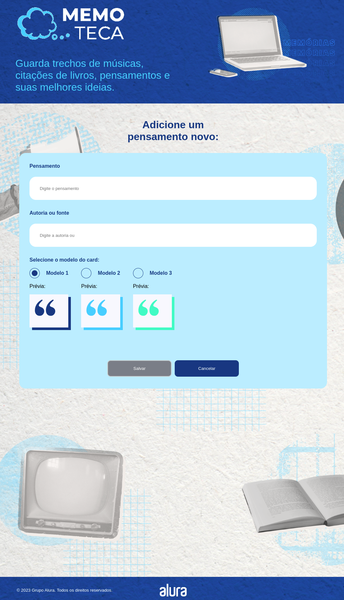
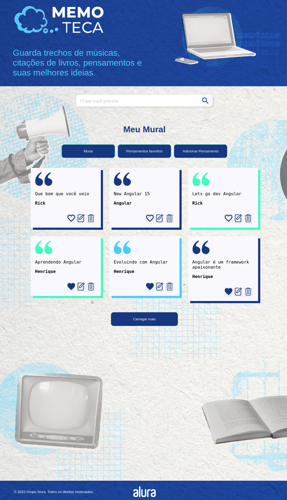
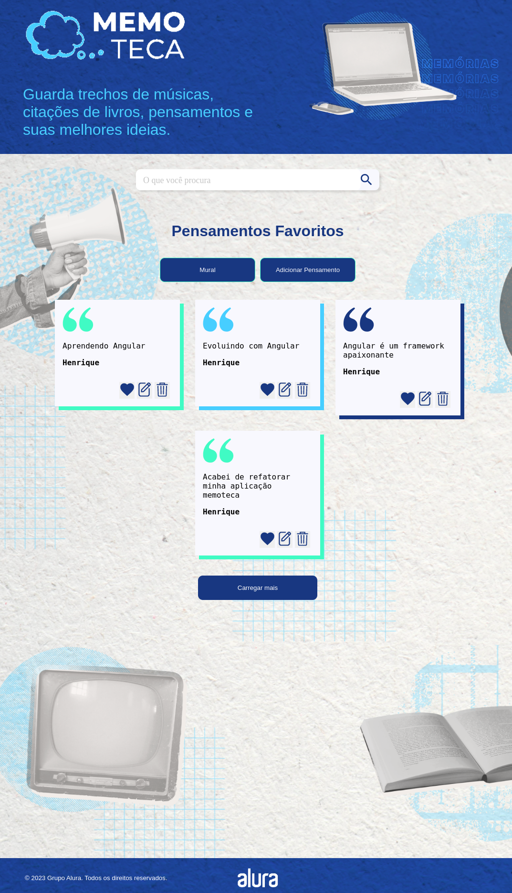

<h1 align="center"> Memo Teca</h1>

 Um mural de pensamentos, onde é possível cadastrar, editar e excluir pensamentos, este projeto foi desenvolvido durante a formação angular do Alura.  

  <a href="#-tecnologias">Tecnologias</a>&nbsp;&nbsp;&nbsp;|&nbsp;&nbsp;&nbsp;
  <a href="#-projeto">Projeto</a>&nbsp;&nbsp;&nbsp;|&nbsp;&nbsp;&nbsp;
  <!-- <a href="#-layout">Layout</a>&nbsp;&nbsp;&nbsp;|&nbsp;&nbsp;&nbsp; -->
  <a href="#memo-licença">Licença</a>

  

 

Tela de cadastro de um novo pensamento: 
 
  

    
  

Tela do mural de todos pensamentos: 
 
  

    
  

Tela dos pensamentos favoritos: 
 
  

    
  

  
  

## 🚀 Tecnologias

Esse projeto foi desenvolvido com as seguintes tecnologias:

- [Angular CLI](https://github.com/angular/angular-cli) version 15.0.4.
- Typescript
- Json Server
- AppRoutingModule,
- FormsModule,
- HttpClientModule,
- ReactiveFormsModule
- Angular Routes
- Git e Github
    
## 💻 Projeto

Para executar o projeto:  

Através de algum terminal execute o seguinte comando:  
`git clone https://github.com/HenriqueMVSS/memoteca-angular`

- ### Após concluir o clone do repositório:  

    Executa o comando `npm install` na raiz do projeto para instalar as dependências do projeto.

- ### Iniciar o backend da aplicação:  

    Após execução do `npm install` na raiz do projeto, executa `cd backend` para entrar no diretório do backend e executa  `npm install` para instalar as dependencias do backend e logo em seguida roda o comando `json-server --watch db.json` para iniciar a aplicação.
    
## :memo: Licença

Esse projeto está sob a licença MIT.

---
